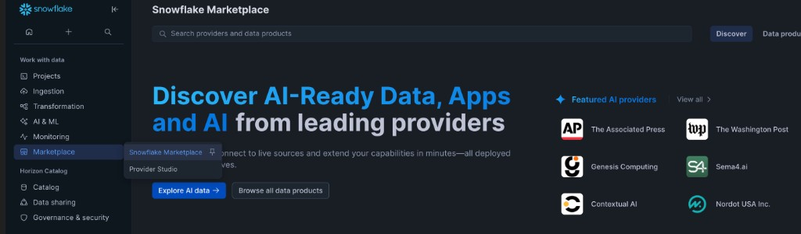
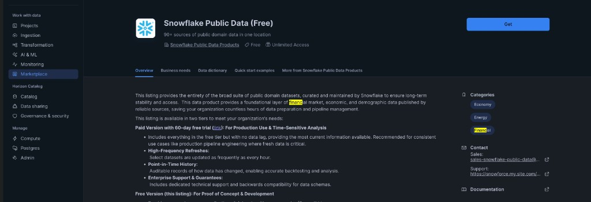
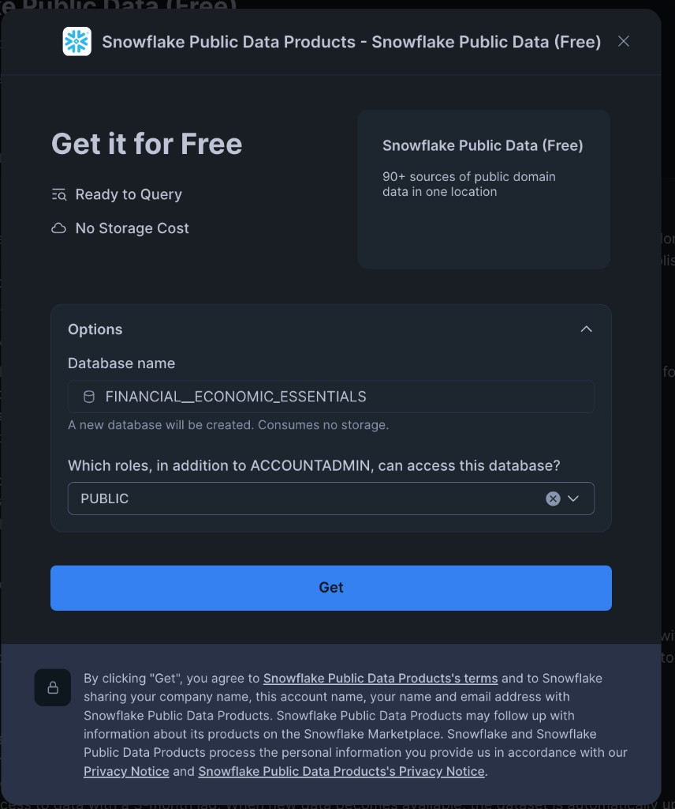
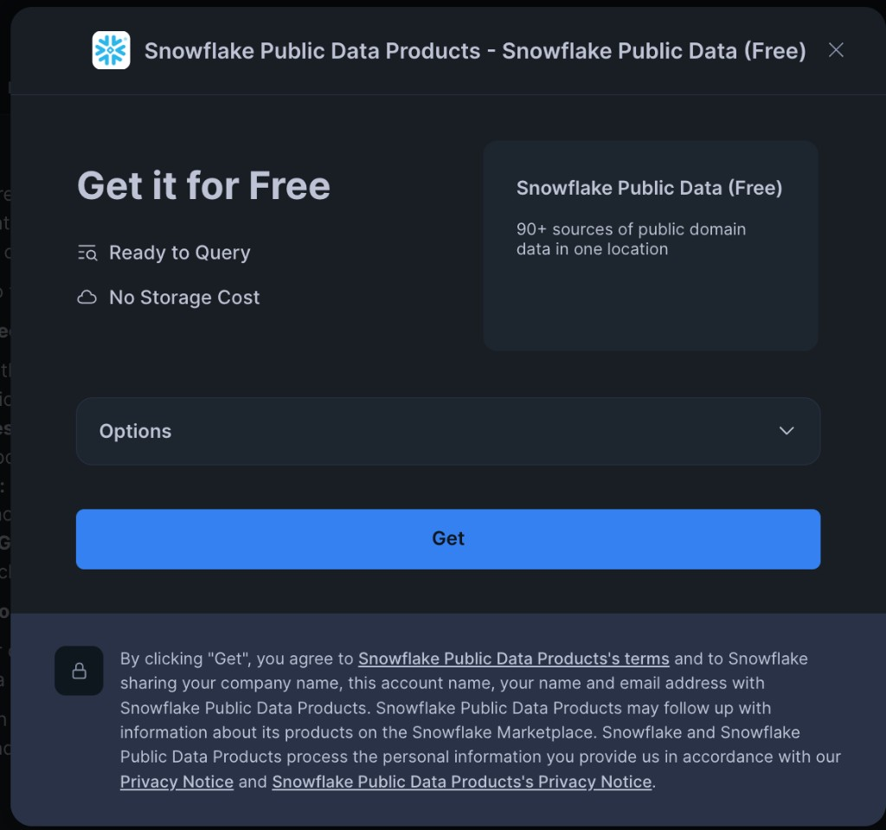
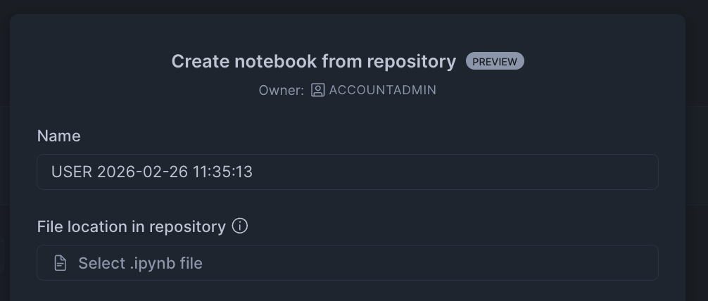
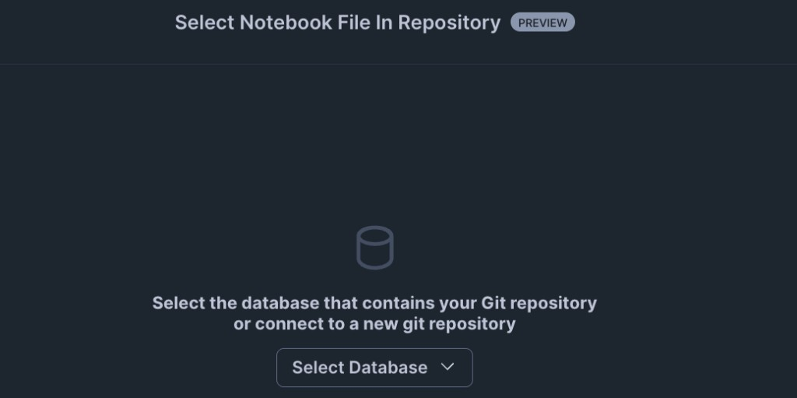
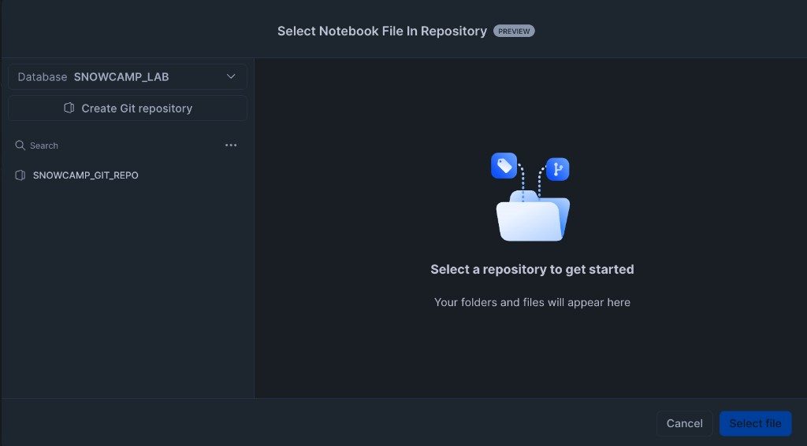
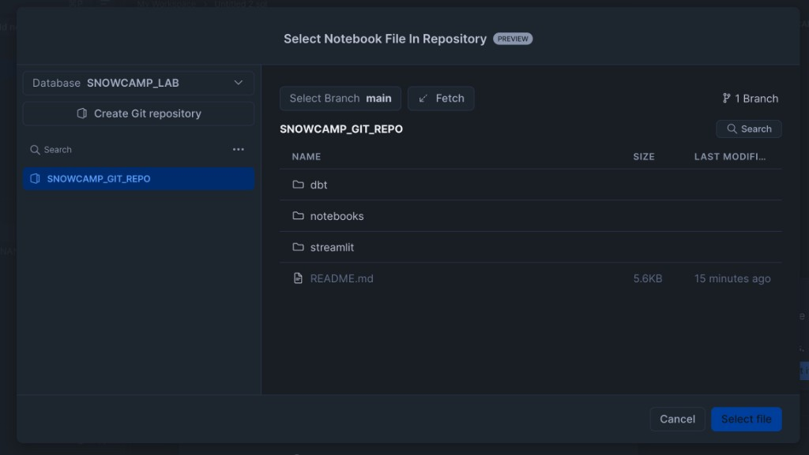
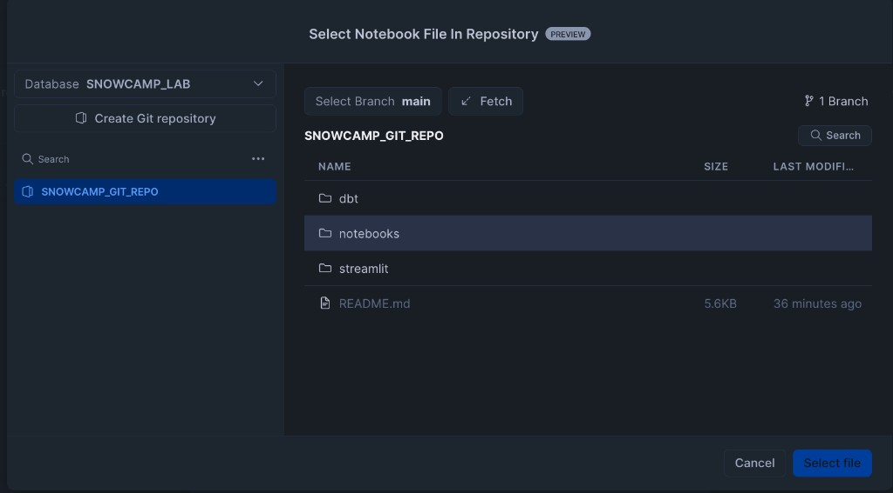
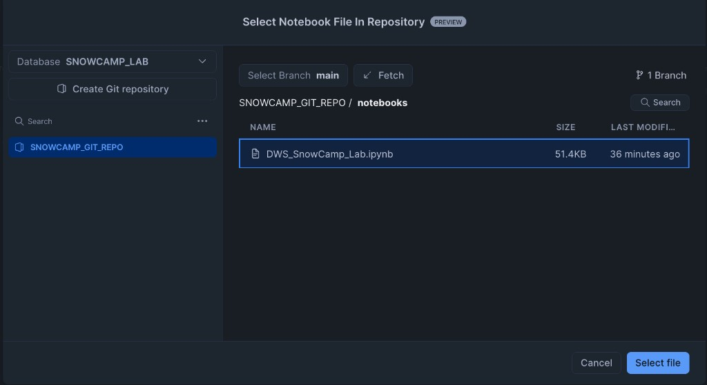

# DWS SnowCamp -- Hands-On Lab

**Building an End-to-End Client Reporting Data Product on Snowflake**

A two-session hands-on lab for the DWS SnowCamp training event. Attendees build a complete data-product pipeline in their own Snowflake trial account: synthetic data generation, dbt transformation and orchestration, Streamlit dashboard, Internal Marketplace listing, platform administration, and AI-assisted development with Cortex Code.

## Prerequisites

- A **Snowflake Trial account** (provided via HOL infrastructure on the day)
- A modern web browser (Chrome, Edge, or Firefox recommended)
- **Snowflake Public Data (Free)** Marketplace listing (installed during Day 1)
- No local software installation required -- everything runs inside Snowsight

## Lab Structure

The lab is split across two sessions, each approximately 1.5 hours:

| Session | Environment | Notebook | Focus |
|---------|-------------|----------|-------|
| **Day 1** | Snowflake Workspaces | `DWS_SnowCamp_Day1.ipynb` | Data engineering: setup, synthetic data, Marketplace, dbt transformation & orchestration |
| **Day 2** | Snowflake Notebook (Legacy) | `DWS_SnowCamp_Day2.ipynb` | Data products: Streamlit dashboard, Horizon Catalog, platform admin, Cortex Code |

## Quick Start

### 1. Log in to your Snowflake trial account

Use the credentials provided at registration.

### 2. Install Snowflake Public Data (Free) from Marketplace

This free dataset provides real NASDAQ stock prices that the lab joins with synthetic holdings.

1. In Snowsight, navigate to **Data Products** > **Marketplace**



2. Search for **Snowflake Public Data** and click on the **Snowflake Public Data (Free)** listing from **Snowflake Public Data Products**



3. Click **Get** to open the install dialog



4. Expand **Options** and confirm the database name is `FINANCIAL__ECONOMIC_ESSENTIALS`. Click **Get** to install.



5. The database `FINANCIAL__ECONOMIC_ESSENTIALS` will appear in your account with no storage cost

### 3. Create a Git Repository integration

Open a **SQL Worksheet** in Snowsight and run:

```sql
-- Create the lab database and warehouse
CREATE DATABASE IF NOT EXISTS SNOWCAMP_LAB;
CREATE SCHEMA IF NOT EXISTS SNOWCAMP_LAB.RAW;

CREATE WAREHOUSE IF NOT EXISTS WH_LAB
    WAREHOUSE_SIZE = 'XSMALL'
    AUTO_SUSPEND   = 60
    AUTO_RESUME    = TRUE;

-- Enable cross-region inference for Cortex AI features
ALTER ACCOUNT SET CORTEX_ENABLED_CROSS_REGION = 'ANY_REGION';

-- Allow Snowflake to connect to GitHub
CREATE OR REPLACE API INTEGRATION snowcamp_git_api
    API_PROVIDER         = git_https_api
    API_ALLOWED_PREFIXES = ('https://github.com/')
    ENABLED              = TRUE;

-- Point to this repository
CREATE OR REPLACE GIT REPOSITORY SNOWCAMP_LAB.RAW.SNOWCAMP_GIT_REPO
    API_INTEGRATION = snowcamp_git_api
    ORIGIN          = 'https://github.com/sfc-gh-epolano/dws-snowcamp-lab.git';

ALTER GIT REPOSITORY SNOWCAMP_LAB.RAW.SNOWCAMP_GIT_REPO FETCH;
```

### 4. Import the Day 1 notebook (Workspaces)

1. Navigate to **Projects** > **Notebooks** in the left sidebar and click the **+** button, then select **Create from Repository**



2. Click **Select .ipynb file** to open the file picker. You will be prompted to select the database that contains your Git repository.



3. Select `SNOWCAMP_LAB` from the database dropdown. You will see `SNOWCAMP_GIT_REPO` appear in the left panel. Click on it.



4. The repository contents will load. You should see the `dbt`, `notebooks`, and `streamlit` folders.



5. Click the **notebooks** folder.



6. Select **`DWS_SnowCamp_Day1.ipynb`** and click **Select file**.



7. Back in the create dialog, set the **Query warehouse** to `WH_LAB` and confirm the role is `ACCOUNTADMIN`. Click **Create**.

### 5. Run Day 1

Execute cells sequentially from top to bottom. Each section includes explanations, SQL/Python code, and links to Snowflake documentation.

### 6. Import the Day 2 notebook (Snowflake Notebook)

On Day 2, repeat steps 4-7 above but select **`DWS_SnowCamp_Day2.ipynb`** instead. Day 2 should be run as a **Snowflake Notebook** (Projects > Notebooks) to enable inline Streamlit widgets.

## Lab Agenda

### Day 1 — Data Engineering in Snowflake Workspaces (~1.5 hours)

| Part | Topic | Duration | What You Build |
|------|-------|----------|----------------|
| 1 | Environment Setup & Synthetic Data | 20 min | Database, schemas, warehouse, 6 raw tables |
| 2 | Snowflake Marketplace Integration | 10 min | Marketplace install, real NASDAQ prices |
| 3 | dbt Transformation | 30 min | Staging, intermediate, mart layers, Marketplace join |
| 4 | dbt Projects: Deploy, Test & Orchestrate | 30 min | dbt Project object, automated tests, scheduled Task |

### Day 2 — Dashboards, Governance & AI (~1.5 hours)

| Part | Topic | Duration | What You Build |
|------|-------|----------|----------------|
| 1 | Streamlit Dashboard | 25 min | Inline dashboard + standalone Streamlit app |
| 2 | Horizon Catalog & Internal Marketplace | 10 min | Horizon tags, share, data product listing |
| 3 | Platform Administration | 15 min | Credit monitoring, query analysis, resource monitors |
| 4 | Cortex Code: What's Next | 10 min | AI-assisted development ideas and prompts |

## Repository Structure

```
dws-snowcamp-lab/
├── README.md                              # This file
├── _generate_notebook.py                  # Script that generates both notebooks
├── notebooks/
│   ├── DWS_SnowCamp_Day1.ipynb           # Day 1: Setup, data, dbt (Workspaces)
│   └── DWS_SnowCamp_Day2.ipynb           # Day 2: Streamlit, Horizon, admin (Notebook)
├── dbt/
│   └── snowcamp_client_reporting/         # dbt Project (deployed in Day 1 Part 4)
│       ├── dbt_project.yml
│       ├── profiles.yml                  # Snowflake connection targets (dev/prod)
│       └── models/
│           ├── staging/                   # Views: clean raw data + Marketplace prices
│           ├── intermediate/              # Tables: join and enrich
│           └── marts/                     # Tables: facts, dimensions, Marketplace join
├── streamlit/
│   └── client_reporting_app.py            # Streamlit app (deployed in Day 2 Part 1)
└── docs/
    └── images/                            # Screenshots for README and notebooks
```

## Data Model

The lab generates synthetic asset-management data across six tables:

```
RAW.CLIENTS (30 rows)           RAW.SECURITIES (50 rows)
    │                               │
    └── RAW.PORTFOLIOS (100 rows)   │
            │                       │
            ├── RAW.HOLDINGS (~5K rows) ──┘
            │       │
            │       └──> ANALYTICS.STG_HOLDINGS
            │                   │
            ├── RAW.TRANSACTIONS (10K rows)
            │       │
            │       └──> ANALYTICS.STG_TRANSACTIONS
            │
            └── RAW.BENCHMARKS (~1.2K rows)
                        │
        ┌───────────────┘
        │
        └──> MARTS.F_POSITIONS_DAILY (fact)
             MARTS.F_PERFORMANCE_DAILY (fact)
             MARTS.F_HOLDINGS_WITH_MARKET_DATA (fact + Snowflake Marketplace)
             MARTS.D_PORTFOLIO (dimension)
             MARTS.D_CLIENT (dimension)
```

## Key Snowflake Documentation Links

| Topic | Link |
|-------|------|
| Snowflake Workspaces | https://docs.snowflake.com/en/user-guide/ui-snowsight/workspaces |
| Snowflake Notebooks | https://docs.snowflake.com/en/user-guide/ui-snowsight/notebooks |
| dbt Projects on Snowflake | https://docs.snowflake.com/en/user-guide/ui-snowsight/dbt |
| CREATE DBT PROJECT | https://docs.snowflake.com/en/sql-reference/sql/create-dbt-project |
| EXECUTE DBT PROJECT | https://docs.snowflake.com/en/sql-reference/sql/execute-dbt-project |
| Deploy dbt Projects | https://docs.snowflake.com/en/user-guide/data-engineering/dbt-projects-on-snowflake-deploy |
| Streamlit in Snowflake | https://docs.snowflake.com/en/developer-guide/streamlit/about-streamlit |
| Snowpark Python | https://docs.snowflake.com/en/developer-guide/snowpark/python/index |
| Horizon Catalog | https://docs.snowflake.com/en/user-guide/governance-horizon |
| Object Tagging | https://docs.snowflake.com/en/user-guide/object-tagging |
| Internal Marketplace | https://docs.snowflake.com/en/user-guide/data-marketplace-internal |
| ACCOUNT_USAGE Views | https://docs.snowflake.com/en/sql-reference/account-usage |
| Resource Monitors | https://docs.snowflake.com/en/user-guide/resource-monitors |
| Git Repository Integration | https://docs.snowflake.com/en/developer-guide/git/git-setting-up |
| Snowflake Public Data (Free) | https://app.snowflake.com/marketplace/listing/GZTSZAS2KCS |
| Cortex Code | https://docs.snowflake.com/en/user-guide/cortex-code/cortex-code-snowsight |
| Introduction to Tasks | https://docs.snowflake.com/en/user-guide/tasks-intro |
| OpenFlow (reference only) | https://docs.snowflake.com/en/user-guide/data-load-openflow |

## Context: DWS SnowCamp

This lab is part of the DWS SnowCamp 2-day training event. The narrative across both days covers:

1. **Ingest** data using synthetic generation (OpenFlow covered in presentation only)
2. **Transform** data using dbt Projects on Snowflake with automated testing
3. **Orchestrate** pipelines with Snowflake Tasks
4. **Present** data through Streamlit dashboards
5. **Discover & govern** data products with Horizon Catalog / Internal Marketplace
6. **Monitor** the platform with credit usage, query insights, and resource monitors
7. **Accelerate** development with Cortex Code

## License

Internal use -- DWS SnowCamp training material.
