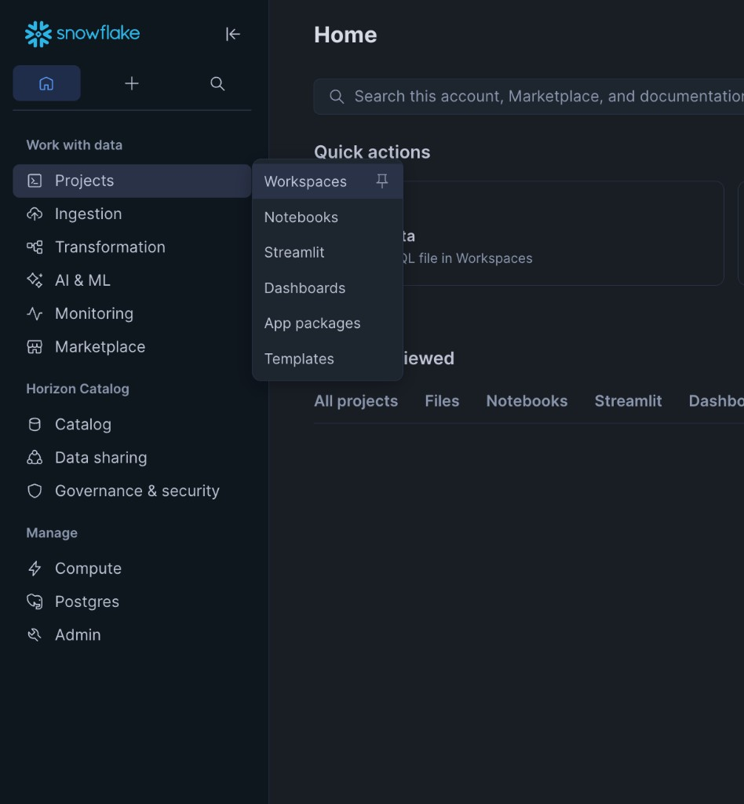
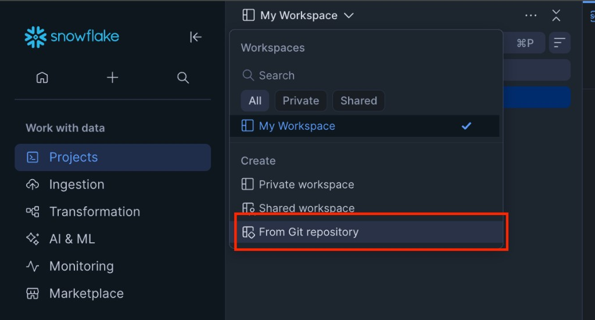
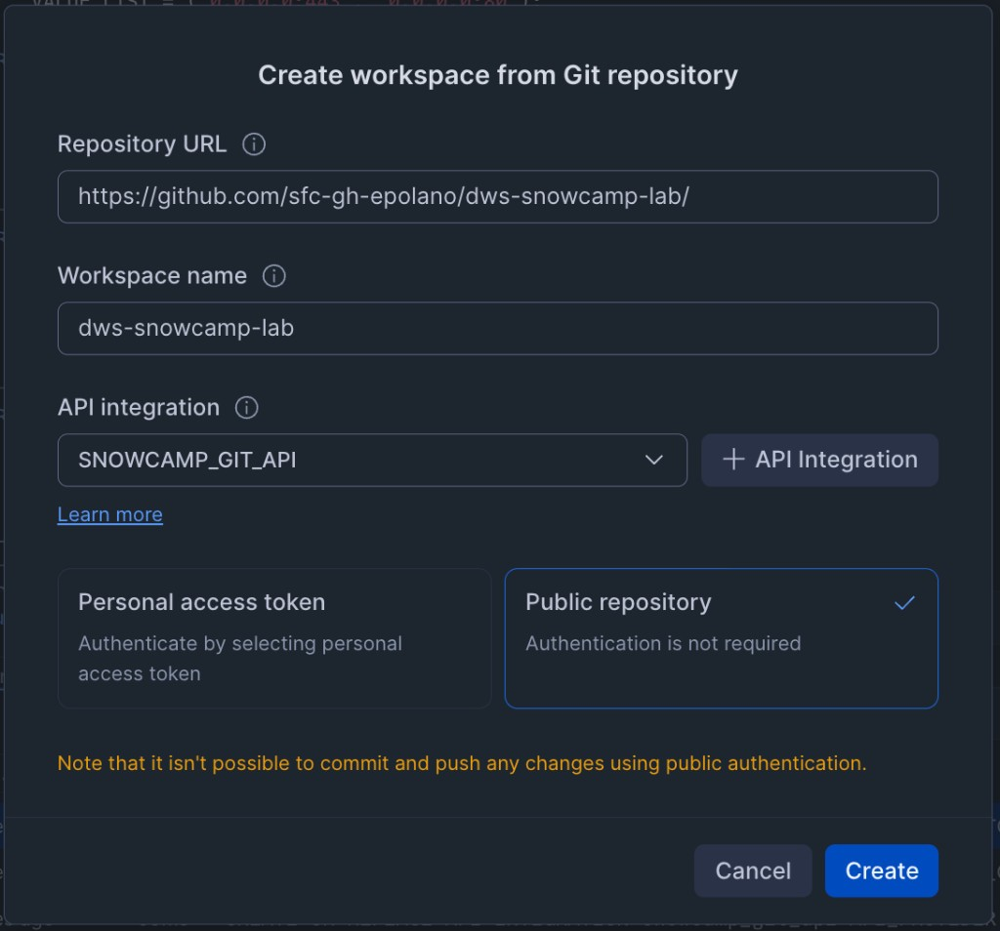

# DWS SnowCamp -- Hands-On Lab

**Building an End-to-End Client Reporting Data Product on Snowflake**

A two-session hands-on lab for the DWS SnowCamp training event. Attendees build a complete data-product pipeline in their own Snowflake trial account: synthetic data generation, dbt transformation and orchestration, Streamlit dashboard, Internal Marketplace listing, platform administration, and AI-assisted development with Cortex Code.

## Prerequisites

- A **Snowflake Trial account** (provided via HOL infrastructure on the day)
- A modern web browser (Chrome, Edge, or Firefox recommended)
- No local software installation required -- everything runs inside Snowsight

## Lab Structure

The lab is split across two sessions, each approximately 1.5 hours. The narrative across both days covers:

1. **Ingest** data using synthetic generation (OpenFlow covered in presentation only)
2. **Transform** data using dbt Projects on Snowflake with automated testing
3. **Orchestrate** pipelines with Snowflake Tasks
4. **Present** data through Streamlit dashboards
5. **Discover & govern** data products with Horizon Catalog / Internal Marketplace
6. **Monitor** the platform with credit usage, query insights, and resource monitors
7. **Accelerate** development with Cortex Code

| Session | Environment | Notebook | Focus |
|---------|-------------|----------|-------|
| **Day 1** | Snowflake Workspaces | `DWS_SnowCamp_Day1.ipynb` | Data engineering: setup, synthetic data, Marketplace, dbt transformation & orchestration |
| **Day 2** | Snowflake Notebook | `DWS_SnowCamp_Day2.ipynb` | Data products: Streamlit dashboard, Horizon Catalog, platform admin, Cortex Code |

### Day 1 -- Data Engineering in Snowflake Workspaces (~1.5 hours)

| Part | Topic | Duration | What You Build |
|------|-------|----------|----------------|
| 1 | Environment Setup & Synthetic Data | 20 min | Database, schemas, warehouse, 6 raw tables |
| 2 | Snowflake Marketplace Integration | 10 min | Marketplace install, real NASDAQ prices |
| 3 | dbt Transformation | 30 min | Staging, intermediate, mart layers, Marketplace join |
| 4 | dbt Projects: Deploy, Test & Orchestrate | 30 min | dbt Project object, automated tests, scheduled Task |

### Day 2 -- Dashboards, Governance & AI (~1.5 hours)

| Part | Topic | Duration | What You Build |
|------|-------|----------|----------------|
| 1 | Streamlit Dashboard | 25 min | Inline dashboard + standalone Streamlit app |
| 2 | Horizon Catalog & Internal Marketplace | 10 min | Horizon tags, share, data product listing |
| 3 | Platform Administration | 15 min | Credit monitoring, query analysis, resource monitors |
| 4 | Cortex Code: What's Next | 10 min | AI-assisted development ideas and prompts |

## Quick Start

### 1. Log in to your Snowflake account

Register and get your lab credentials at [https://go.dataops.live/dws-snowcamp/register](https://go.dataops.live/dws-snowcamp/register). Your Snowflake account, database, warehouse, Git integration, and notebooks are pre-deployed automatically by the Hands-On Lab pipeline.

### 2. Import the Day 1 notebook (Workspaces)

1. In the left sidebar, hover over **Projects** and select **Workspaces**



2. In the Workspace dropdown at the top left, select **From Git repository**



3. In the **Create workspace from Git repository** dialog, enter the repository URL (`https://github.com/sfc-gh-epolano/dws-snowcamp-lab/`), choose a workspace name, select your `SNOWCAMP_GIT_API` integration, and choose **Public repository**. Click **Create**.



4. Once the workspace is created, open `notebooks/DWS_SnowCamp_Day1.ipynb` from the file explorer

### 3. Create a Workspaces notebook service

Before running the Day 1 notebook, create a notebook service in Workspaces. This provides the compute environment for running Python and SQL cells.

1. Open any notebook (or create a temporary one) and select **Connected** in the top bar
2. Create a new notebook service with the following settings:
   - **Compute pool**: Select an available compute pool (or use the default)
   - **Query warehouse**: `WH_LAB`
   - **External access integrations**: Select `SNOWCAMP_EXTERNAL_ACCESS` to allow the service to reach external endpoints (e.g. `pip install`)

For more details, see [Compute setup for Notebooks in Workspaces](https://docs.snowflake.com/en/user-guide/ui-snowsight/notebooks-in-workspaces/notebooks-in-workspaces-compute-setup).

### 4. Run Day 1

Execute cells sequentially from top to bottom. Each section includes explanations, SQL/Python code, and links to Snowflake documentation.

### 5. Run Day 2

Day 2 covers Streamlit dashboards, Horizon Catalog, platform administration, and Cortex Code. The notebook (`DWS_SnowCamp_Day2.ipynb`) is pre-deployed by the Hands-On Lab pipeline — open it from **Projects** > **Notebooks** and execute cells sequentially from top to bottom.

## Repository Structure

```
dws-snowcamp-lab/
├── README.md                              # This file
├── LEGAL.md                               # Snowflake legal disclaimer
├── LICENSE                                # Apache License 2.0
├── _generate_notebook.py                  # Script that generates both notebooks
├── notebooks/
│   ├── DWS_SnowCamp_Day1.ipynb           # Day 1: Setup, data, dbt (Workspaces)
│   └── DWS_SnowCamp_Day2.ipynb           # Day 2: Streamlit, Horizon, admin (Notebook)
├── dbt/
│   └── snowcamp_client_reporting/         # dbt Project (deployed in Day 1 Part 4)
│       ├── dbt_project.yml
│       ├── profiles.yml                  # Snowflake connection targets (dev/prod)
│       └── models/
│           ├── staging/                   # Views: clean raw data + Marketplace prices
│           ├── intermediate/              # Tables: join and enrich
│           └── marts/                     # Tables: facts, dimensions, Marketplace join
├── streamlit/
│   └── client_reporting_app.py            # Streamlit app (deployed in Day 2 Part 1)
└── docs/
    └── images/                            # Screenshots for README and notebooks
```

## Data Model

The lab generates synthetic asset-management data across six tables:

```
RAW.CLIENTS (30 rows)           RAW.SECURITIES (50 rows)
    │                               │
    └── RAW.PORTFOLIOS (100 rows)   │
            │                       │
            ├── RAW.HOLDINGS (~5K rows) ──┘
            │       │
            │       └──> ANALYTICS.STG_HOLDINGS
            │                   │
            ├── RAW.TRANSACTIONS (10K rows)
            │       │
            │       └──> ANALYTICS.STG_TRANSACTIONS
            │
            └── RAW.BENCHMARKS (~1.2K rows)
                        │
        ┌───────────────┘
        │
        └──> MARTS.F_POSITIONS_DAILY (fact)
             MARTS.F_PERFORMANCE_DAILY (fact)
             MARTS.F_HOLDINGS_WITH_MARKET_DATA (fact + Snowflake Marketplace)
             MARTS.D_PORTFOLIO (dimension)
             MARTS.D_CLIENT (dimension)
```

## Key Snowflake Documentation Links

| Topic | Link |
|-------|------|
| Snowflake Workspaces | https://docs.snowflake.com/en/user-guide/ui-snowsight/workspaces |
| Snowflake Notebooks | https://docs.snowflake.com/en/user-guide/ui-snowsight/notebooks |
| dbt Projects on Snowflake | https://docs.snowflake.com/en/user-guide/ui-snowsight/dbt |
| CREATE DBT PROJECT | https://docs.snowflake.com/en/sql-reference/sql/create-dbt-project |
| EXECUTE DBT PROJECT | https://docs.snowflake.com/en/sql-reference/sql/execute-dbt-project |
| Deploy dbt Projects | https://docs.snowflake.com/en/user-guide/data-engineering/dbt-projects-on-snowflake-deploy |
| Streamlit in Snowflake | https://docs.snowflake.com/en/developer-guide/streamlit/about-streamlit |
| Snowpark Python | https://docs.snowflake.com/en/developer-guide/snowpark/python/index |
| Horizon Catalog | https://docs.snowflake.com/en/user-guide/governance-horizon |
| Object Tagging | https://docs.snowflake.com/en/user-guide/object-tagging |
| Internal Marketplace | https://docs.snowflake.com/en/user-guide/data-marketplace-internal |
| ACCOUNT_USAGE Views | https://docs.snowflake.com/en/sql-reference/account-usage |
| Resource Monitors | https://docs.snowflake.com/en/user-guide/resource-monitors |
| Git Repository Integration | https://docs.snowflake.com/en/developer-guide/git/git-setting-up |
| Cortex Code | https://docs.snowflake.com/en/user-guide/cortex-code/cortex-code-snowsight |
| Introduction to Tasks | https://docs.snowflake.com/en/user-guide/tasks-intro |
| OpenFlow (reference only) | https://docs.snowflake.com/en/user-guide/data-load-openflow |

## Legal

This application is not part of the Snowflake Service and is governed by the terms in [LICENSE](LICENSE), unless expressly agreed to in writing. You use this application at your own risk, and Snowflake has no obligation to support your use of this application.

## License

Licensed under the Apache License, Version 2.0. See [LICENSE](LICENSE) for details.
